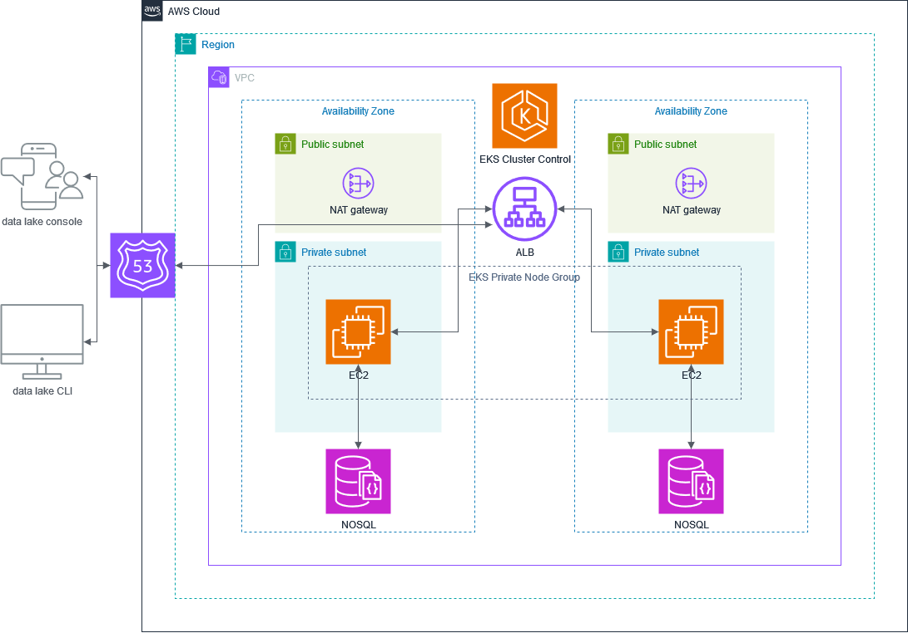
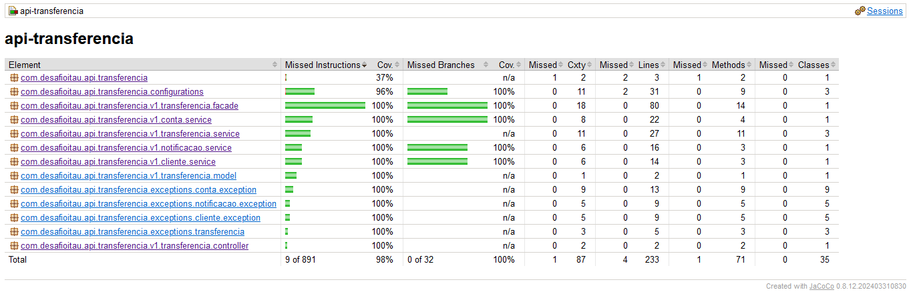

# Desafio itaú

Instruções para subir a aplicação e testar localmente

## Passo 1: Preparação do Ambiente

Clone o repositório do projeto para sua máquina local usando o Git:

```bash
git clone https://github.com/luizfelipetozatti/DesafioItau.git
cd DesafioItau
```

## Passo 2: Construção dos Containers com Docker Compose

Na raiz do projeto, onde o arquivo docker-compose.yml está localizado, execute o comando abaixo para construir e iniciar todos o container definido no Docker Compose:

```bash
docker-compose up --build -d
```

> **Lista de containers**
>  - Zookeeper
>  - Kafka
>  - Kafdrop - http://localhost:19000/
>  - Mongo
>  - Mongo-Express - http://localhost:8081
>  - Wiremock
>  - Api-Transferencia -  http://localhost:8080

## Swagger da api

http://localhost:8080/swagger-ui.html

## POST API Transferência

http://localhost:8080/v1/transferencias

+ Request (application/json)

  + Body

          {
            "idCliente": "2ceb26e9-7b5c-417e-bf75-ffaa66e3a76f",
            "valor": 100.00,
            "conta": {
                "idOrigem": "d0d32142-74b7-4aca-9c68-838aeacef96b",
                "idDestino": "41313d7b-bd75-4c75-9dea-1f4be434007f"
            }
          }

+ Response 200 (application/json)

  + Body

          {
              "id_transferencia": "410bb5b0-429f-46b1-8621-b7da101b1e28"
          }

## Melhorias
+ Dividir o projeto em 3 diferentes:
  + **api-transferencia:** responsável por receber as requisições de transferência e postar na fila do kafka
  + **consumer-transferencia:** responsável por consumir as mensagens postadas no kafka
  + **notificacao-transferencia:** responsável por enviar uma notificação psuh para o celular do usuário informando os dados e status da transferência (braze por exemplo)

+ Utilização de cache no método que consulta os dados do cliente.
  + Um cache como uma pilha/fila com limite de 1000 registros, por exemplo.

## Proposta de observabilidade
Pode-se utilizar o New Relic. Uma plataforma de monitoramento e performance de aplicações (Application Performance Monitoring - APM). Com ele é possível acompanhar e coletar todo tipo de métrica, logs e eventos. Criar dashboards para ajudar identificar bugs, consumo de memória, CPU e uso de disco. Importante para o monitoramento dos clusters, trhoughput e erros.

## Arquitetura


## Cobertura de testes
